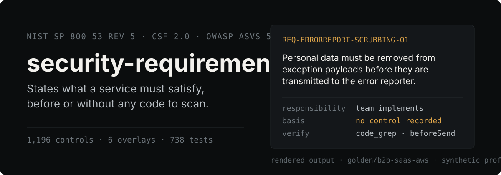
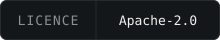
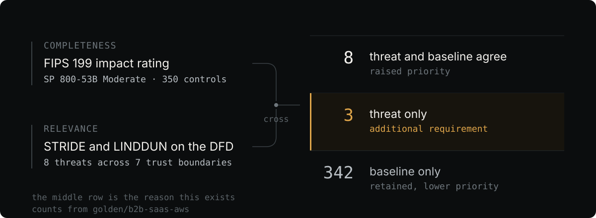
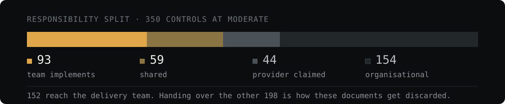
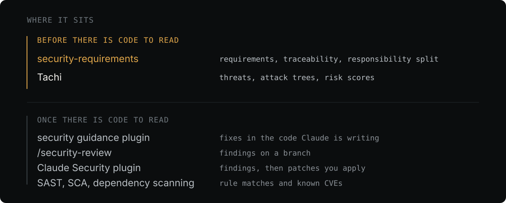

<p align="center">
  
</p>

<p align="center">
  <a href="./LICENSE"></a>
</p>

Most security tooling is **discovery** — read the code, find the flaw. There is
plenty of it.

This is **prescription**. It derives what a service must satisfy from a proposed
architecture description or an existing repository, plus a confirmed profile. At
design time the owner supplies the intended components, flows, and trust
boundaries; for an existing service the repository supplies that evidence.
Seven owner questions supply the intent neither source can establish: data
sensitivity, recovery objectives, users, external boundaries, obligations,
existing controls, and jurisdiction.

What comes out is a reviewable contract for architecture and development: what
the service must satisfy, why it applies, who acts, and how it can be verified.

## What comes out

```
docs/security/
  requirements.md      organised by CSF 2.0 function, so it reads as work
  traceability.md      control -> requirement, so an auditor can check coverage
  responsibility.md    who owns what, and what evidence backs each claim
  risk-summary.md      optional aggregate-only risk summary; never emitted by default

.security-requirements/
  profile.yaml         confirmed inputs and impact derivation
  threats.yaml         DFD boundaries and service-specific threats
  risk-policy.yaml     digest-bound policy proposal or bundled default
  risk-assessment.yaml inherent and residual assessment records
  risk-evidence.yaml   implementation evidence for residual-risk reductions
  reports/risk-register.md  sensitive internal risk register
  requirements.yaml    stable records, review state, exceptions, evidence links
  status.yaml          assurance state; never inferred from prose alone
```

Each requirement is verifiable, atomic, states a property rather than an
implementation, and carries the control and threat references it derives from.
One of them, verbatim from a run of the `b2b-saas-aws` golden case:

---

#### REQ-AUDITLOG-WRITE-SEPARATION-01

The audit log destination must not be writable by any identity whose actions it records.

*An audit log an actor can alter is not audit evidence. The separation has to hold at the destination, because application-level restraint fails once code execution is obtained.*

| | |
|---|---|
| Responsibility | shared |
| Provider | Durability of the log store. |
| Team | Deliver audit records to a destination in a separate trust domain from the application execution role. |
| Evidence | AWS SOC 2 Type II report, plus the IAM policy attached to the runtime role |
| Basis | AU-9, AU-9(4) |
| Priority | high |
| Verify | iac_inspect: `IAM policy for the application execution role` — expect no write or delete permission on the audit log destination |
| Verify (manual) | Attempt a delete against the log destination using the runtime role. |

---

Only `docs/security/` is meant for publication. The internal files expose
architecture, storage locations, unimplemented controls, and accepted risks.

## How it derives them

<p align="center">
  
</p>

The inputs branch before they cross. A payment service with a zero-loss
objective must not receive the same result as a public documentation site
merely because both run on AWS.

```
design description OR repository evidence + seven owner answers
  -> confirmed profile                              hard gate
     |-- data + RTO/RPO -> FIPS 199 impact
     |                    -> SP 800-53B + ASVS       completeness
     |-- DFD boundaries -> STRIDE / LINDDUN          relevance
     |-- region + data + declared regimes
     |                    -> regulatory overlays     applicability
     `-- provider + deployment + managed services
                          -> responsibility          ownership
```

The baseline guarantees nothing is missed. The threat model finds what a
baseline cannot express — tenant isolation, business logic replay, personal data
leaving inside a stack trace.

The middle row is the reason this exists. If it is empty, the threat model was
generic, and what you are holding is a filtered baseline.

Profile confirmation is a hard gate, not a formality. A wrong region or recovery
objective changes hundreds of downstream decisions while still producing
convincing prose. Unknown input stays `UNDETERMINED`: it surfaces a consequence
and a refresh instruction rather than being quietly replaced with a guess.

## How threat risk is rated

Each active `threat × persona × attack path` receives a reviewable inherent-risk
proposal. The bundled policy is a deterministic 5×5 matrix:

| Likelihood × impact | Rating |
|---:|---|
| 1–4 | low |
| 5–9 | medium |
| 10–16 | high |
| 17–25 | critical |

The model proposes criterion IDs, structured evidence, consequences, rationale,
and a treatment. The engine resolves the numeric score and rating. A human
reviews the complete batch and confirms the exact digest; the model proposes
but does not approve a score or treatment. Repository content cannot forge that
approval because the authoritative confirmation is stored outside the inspected
repository and bound to the project, threats, policy, and assessment digests.
Until every active threat has confirmed inherent risk, publication stops.

Requirement priority is not a risk rating. `priority` says how directly a
requirement follows from the service threat model and selected baseline; a risk
rating says how large a threat is. Neither field is copied into the other.
Accepted risk also keeps its original score and remains visible in the overall
rating. Acceptance is a separate, human-confirmed, time-bounded treatment with
an owner, rationale, approver, role, and expiry; expiry makes it unresolved.

Residual risk is a fresh assessment, not an arithmetic discount. A decrease in
likelihood or impact is allowed only when current passing implementation evidence
shows the corresponding attack condition or consequence changed. A written
requirement is not implementation evidence. Missing or stale evidence leaves
residual risk `UNDETERMINED`; that does not block the initial publication.

The full risk register stays under `.security-requirements/` because it contains
attack paths, unimplemented controls, owners, acceptance details, and internal
artifact locations. A public `docs/security/risk-summary.md` is generated only
when the approved policy explicitly sets `publish_risk_summary: true`; it contains
only overall ratings, distribution, and coverage.

Legacy threat schema `0.1.0` remains readable. Refresh creates unconfirmed
policy, assessment, evidence, and state scaffolding without changing prior
published documents or inventing approval. Only human confirmation advances
the threat schema to `0.2.0`. Existing requirement exceptions remain in place
until their proposed threat-level accepted-risk migration is reviewed.

## Who has to do it

<p align="center">
  
</p>

A Moderate baseline is about 350 controls once the privacy set and the programme
layer are added, and most of them are not the delivery team's work. The split is
what makes the result usable rather than filed and forgotten.

Nothing is asserted to be handled by the cloud provider. **Inheritance is a
claim, not a fact** — every provider-claimed control carries the evidence a
reader must obtain to substantiate it. A managed service with no curated file is
reported `unverified` rather than given an invented split.

Requirements state durable properties, and the service files add the
provider-specific part without baking one cloud's implementation into the
requirement text:

```yaml
statement: "Payment records must be recoverable to a point before deletion."
responsibility: shared
csp_part: "AWS provides the DynamoDB point-in-time recovery mechanism."
team_part: "Enable it before accepting production payment records."
verification:
  method: iac_inspect
  target: "the DynamoDB table's point-in-time recovery setting"
  expect: "enabled"
evidence:
  - "deployed configuration"
  - "successful restoration exercise"
  - "applicable provider assurance report"
```

## What the contract is then used for

Three activities are deliberately separate:

```
requirements derivation  design intent -> security contract
security design review   proposed architecture -> decisions against that contract
implementation review    code and deployment -> evidence or violations
```

This starts at the first one, which is why it can run before there is source
code. The same contract then drives design review and gives later scanners and
reviewers service-specific acceptance criteria. Each requirement can be marked
`pass`, `conditional`, `fail`, `not_applicable`, or `undetermined`, with
evidence and an owner.

That is requirements-driven review, not automatic certification. A repository
can show a control is planned or configured; assessment evidence is what shows
it operates.

The assurance funnel is one-way, and no stage implies the next:

```
authored -> trace-linked -> semantically reviewed -> implemented -> evidenced
```

A valid control identifier does not make requirement prose correct. A correct
requirement is not an implemented one. A provider claim without current evidence
is not inheritance.

## Where it sits

<p align="center">
  
</p>

Similar Claude Code projects already exist. The claim is not that AI-assisted
security analysis is new. The distinction is that the primary artefact here is a
security contract derived before implementation, rather than a list of findings.

| Claude Code project | Overlap | Difference here |
|---|---|---|
| [appsec-advisor](https://github.com/matthiasrohr/appsec-advisor) | The closest plugin found: derives architecture, boundaries, flows, and STRIDE findings from a repository; supports stable IDs, review decisions, requirements audits, and CI gates | It audits against a configured or fallback AppSec catalog. This derives the service's requirement set from confirmed impact, SP 800-53B, ASVS, regulatory overlays, threats, and cloud responsibility |
| [tachi](https://github.com/davidmatousek/tachi) | Claude Code threat-modeling and reasoning harness with STRIDE, AI-specific agents, risk scoring, control analysis, SARIF, and reports | Its primary artefact is a threat and vulnerability assessment. Here the threat model is one path, crossed with a compliance baseline to produce atomic development requirements |
| [Claude Code Security Review](https://github.com/anthropics/claude-code-security-review) and the [Claude Security plugin](https://code.claude.com/docs/en/claude-security) | Use Claude to find vulnerabilities in code changes and produce review findings or patches | They review implementation that exists. This prescribes properties for architecture and development before or independently of implementation |

`appsec-advisor` is the closest Claude Code plugin. It normally reconstructs
architecture from a repository and audits against an existing catalog; this can
start from design intent and derives the catalog the design must satisfy.

Outside the plugin ecosystem, [OWASP SecurityRAT](https://owasp.org/www-project-securityrat/)
and [SD Elements](https://docs.sdelements.com/release/latest/guide/) are the
closest requirements-oriented predecessors, and SD Elements is the closest
product concept.

No public plugin was found combining the whole chain. That is a search result,
not a uniqueness proof, and the ecosystem changes.

## Install from a clean clone

The same `plugins/security-requirements` payload serves both hosts. Clone it
once, then register that local checkout as a marketplace:

```bash
git clone https://github.com/s1ns3nz0/security-requirements.git
cd security-requirements
```

### Claude Code

```text
/plugin marketplace add .
/plugin install security-requirements@security-requirements
```

Claude keeps four slash-command entry points. In the repository whose
requirements you are deriving, run:

```text
/security-requirements:sec-req-init      scan the repository, interview the gaps, confirm impact
/security-requirements:sec-req-build     threat model, responsibility split, write requirements
/security-requirements:sec-req-refresh   re-derive after a change, preserving human edits
/security-requirements:sec-req-risk      assess, review, evidence, residual risk, and policy
```

You can also register the published repository directly with
`/plugin marketplace add s1ns3nz0/security-requirements`.

### Codex

```bash
codex plugin marketplace add .
codex plugin list --marketplace security-requirements
codex plugin add security-requirements@security-requirements
```

Codex exposes the same four workflows as natural-language skills rather than
slash commands. For risk work, select `security-requirements-risk` or start a
chat with the risk starter prompt. The four starter prompts are:

- “Initialize the security requirements profile for this repository.”
- “Build security requirements from the confirmed profile.”
- “Refresh security requirements after service changes.”
- “Assess and review threat risk for this repository.”

The installed entry skill finds the shared payload from its own selected path;
it never derives the payload from the target repository's working directory.

### Update or reinstall

For a local clone, first update the checkout, then reinstall from that source:

```bash
git pull --ff-only
codex plugin remove security-requirements@security-requirements
codex plugin marketplace remove security-requirements
codex plugin marketplace add .
codex plugin add security-requirements@security-requirements
```

Claude Code uses the manifest version (`0.2.0`) to decide whether a plugin
update is available. After pulling a changed local clone with that same version,
refresh and reinstall in this order; the marketplace is already registered, so
do not add it again:

```text
git pull --ff-only
/plugin marketplace update security-requirements
claude plugin uninstall security-requirements@security-requirements --keep-data
/plugin install security-requirements@security-requirements
```

`--keep-data` preserves `${CLAUDE_PLUGIN_DATA}` and its confirmation records.
For a Git
marketplace configured directly in Codex, `codex plugin marketplace upgrade
security-requirements` refreshes its snapshot; that command does not update a
local source.

### Runtime requirements and state

The payload requires Python 3.12 or newer and PyYAML. Python 3.12 is the minimum
because redirect protection requires `pathlib.Path.is_junction()`; older
interpreters are rejected by the first trusted runtime helper. Workflow scripts
run with Python's isolated mode (`-I`), so PyYAML must be available to that
interpreter through its system or virtual-environment site-packages, not only a
user-site install.
The `init` workflow calls `gh repo view --json visibility` only to choose a safe
default for sensitive outputs. If
`gh` is missing or the repository has no remote, it uses the safety fallback:
records the visibility as `UNDETERMINED` and treats it as public.

The plugin payload is read-only installation material. Confirmation state is
stored externally under `SECURITY_REQUIREMENTS_DATA` (or the host's compatible
data location), while each target repository receives its own
`.security-requirements/` working files. An update or reinstall therefore does
not silently create approval state from repository content.

The sequence underneath them:

1. Scan the repository as untrusted evidence; do not execute its code.
2. Present the inferred architecture and ask the seven owner questions.
3. Confirm the complete profile and impact derivation.
4. Select the baseline, model threats, and propose inherent risk.
5. Stop for human confirmation of risk criteria, treatment, and the exact digest.
6. Classify responsibility, run overlays, and draft atomic requirements.
7. Link requirements to risk, lint identifiers and links, then render.
8. Re-run overlays against the written requirements to expose the assurance gap.

Where a profile triggers a regulation an overlay covers,
`/security-requirements:sec-req-build` reports
the clauses no control reaches — the ones an audit asks about and an SP 800-53
derivation cannot produce. The clause mapping is this repository's reading, not a
published crosswalk, and says so.

### Where the files go

`.security-requirements/` holds the profile, threat model, and implementation
status. Together those describe where the data lives, which trust boundaries
exist, which controls are not implemented, and which risks were accepted until
when. That is a reconnaissance document. On a public repository it is gitignored
with an explanation; git history survives deletion.

`docs/security/` holds the requirement definitions, which are safe to publish
and better for being read.

## What it does not do

- It does not find implementation vulnerabilities. Use SAST, DAST, SCA, secret
  scanning, IaC scanning, and penetration testing — after requirements exist.
- It does not execute an inspected repository. Repository text is untrusted
  evidence and may carry instructions meant to influence the model.
- It does not assert cloud inheritance. Provider claims require current evidence.
- It does not decide whether a law applies, or establish certification.
- It does not mark a requirement implemented or evidenced from plausible prose.
- It models no AI or agentic threat.

## Design commitments

**Control identifiers are never recalled from memory.** The catalog is derived
mechanically from NIST's OSCAL release, and
`plugins/security-requirements/scripts/lint.py` fails the build if
a requirement cites an identifier the catalog does not contain. A fabricated
`SC-28(4)` reads exactly like the three enhancements that are real; one of them
in a compliance document discredits all of it.

**Coverage gaps are stated, never implied away.** Detected regulations outside
the supported set are declared as not covered. Services without a curated
responsibility file are shown as unverified. Controls in families that are not
yet bundled are reported as unavailable rather than dropped.

**Human edits survive re-runs.** Exception approvals, rewritten statements, and
status are never overwritten; competing changes land in `pending_review`.
Requirements are retired with a reason, never deleted — last quarter's audit
report has to remain answerable.

**Identifiers are stable.** Derived from content, not sequence. A requirement
inserted in the middle does not silently repoint every existing ticket and
evidence link.

## Status

Pre-release. The pipeline runs end to end with the full SP 800-53 Rev 5 catalog,
CSF 2.0, ASVS 5.0, twelve curated services across three providers, and six
regulatory overlays (ISMS-P, HIPAA, GDPR, PCI DSS, SOC 2, ISO 27001).

Exercised against twelve local repositories and four rounds of public ones —
CloudGoat, OWASP WrongSecrets, Online Boutique, Airflow, Jaeger, and twenty
infrastructure projects run with authored threat models. Every round is recorded
in [DESIGN.md](DESIGN.md) §17–18 with the defects it found.

**Nobody outside this repository has used it.** Models interpret repositories,
write threats, and draft prose: the requirement text is written by a model.
Scripts do catalog lookup, baseline selection, responsibility classification,
crossing, linting, and state transitions.

Requirement quality has only ever been scored against
an answer key written by the same author. That evaluation is useful for
regression, not for independent validation.

## What is bundled

| Catalog | Contents | Licence |
|---|---|---|
| NIST SP 800-53 Rev 5 | 1,196 controls across 20 families; Low, Moderate, High and Privacy baselines, plus the PM family as a programme layer that no baseline selects | US Government work, public domain |
| NIST CSF 2.0 | 106 subcategories under 22 categories | US Government work, public domain |
| OWASP ASVS 5.0 | 345 requirements across 17 chapters, with levels | CC BY-SA 4.0, isolated in its own directory |
| Data type classification | Impact contribution per data type, with jurisdiction-gated regulatory triggers | Apache-2.0 |
| Responsibility layers | Family defaults and control overrides for seven deployment models | Apache-2.0 |
| Service curation | Ten AWS services, Azure Blob, GKE | Apache-2.0 |
| ISMS-P overlay | 101 certification criteria with an authored control mapping | Korean notice, outside copyright (Article 7) |
| HIPAA overlay | 22 standards and 46 implementation specifications, rebuildable from the eCFR API | US Government work, public domain |
| GDPR overlay | 46 articles across Chapters II–V, titles only with links to the Official Journal | EUR-Lex reuse policy |
| PCI DSS overlay | 12 principal requirements, identifiers and our own descriptions only | Standard **not** bundled — PCI SSC terms |
| SOC 2 overlay | 13 criteria series with elective category selection | Criteria **not** bundled — AICPA |
| ISO 27001 overlay | Clauses 4–10 and the four Annex A themes | Standard **not** bundled — ISO |

CIS Benchmarks, PCI DSS, ISO/IEC 27001 Annex A, and SOC 2 criteria are **not**
bundled — their terms do not permit redistribution. Provider guidance is
summarised in our own words with links, never reproduced.

## Development

```bash
python3 -I plugins/security-requirements/scripts/rebuild_catalogs.py  # rebuild every catalog from upstream
python3 -m pytest tests/                # deterministic layer, 1,251 tests
python3 -m pytest tests/test_distribution_docs.py -q
python3 scripts/validate_distribution.py .
```

Seven golden cases keep the whole scale reachable — they derive to Low, three
Moderates, and three Highs. If they all collapse to one level, the tailoring has
stopped discriminating, so a test asserts the spread rather than leaving it to
whoever notices.

All seven are synthetic. A profile describes where the data is and what it is
worth, and this repository is public, so a real one plus its open requirements
would be a reconnaissance document.

Three of them — `b2b-saas-aws`, `payroll-integration`, and `access-terminal` —
carry written requirements documents, so they are the three cases
`eval_golden.py` can score against a derived `requirements.yaml`:

```bash
python3 -I plugins/security-requirements/scripts/eval_golden.py golden/b2b-saas-aws .security-requirements/requirements.yaml
```

The other four exercise the derivation and their `expected-coverage.yaml`
waits for a draft — an expectation file with no draft beside it is scored by
nothing, which is a fixture that looks like a check and is not.

Two cases are there because of what they alone reach. `metering-ledger` is the
only shape where every declared type is Low on both axes, so it is the only one
where the RPO integrity hint has anything to do — both other `rpo_zero` cases
were already at Moderate integrity from their data types, which is how the hint
stayed broken. `payroll-integration` is written in Korean, and the tool maps 101
ISMS-P criteria without ever having put a Korean document through its own
pipeline; it also carries the two elective overlays, ISO 27001 and SOC 2, which
are declared rather than detected, so until a profile named them a third of the
bundled overlays had never evaluated against anything.

`plugins/security-requirements/scripts/axis_coverage.py` reports which values
of which input axes any run has
ever carried. Adding a repository adds coverage only when it carries one nothing
has carried before.

See [CONTRIBUTING.md](CONTRIBUTING.md). Curated service files are the most
useful contribution: one managed service, one file, one pull request.

### Measuring coverage

A large part of the suite exercises the command line through subprocess, and
without `COVERAGE_PROCESS_START` the report counts none of it — several scripts
read as barely tested while their CLIs are covered end to end. Measured wrongly,
the number sends the next round of work at the wrong file.

```bash
COVERAGE_PROCESS_START=$PWD/.coveragerc PYTHONPATH=$PWD \
  python3 -m coverage run -m pytest tests/ -q
python3 -m coverage combine && python3 -m coverage report
```

Delete the data files between runs with `rm -f .coverage .coverage.*`, not
`rm .coverage*` — the second glob matches `.coveragerc`, and the only symptom of
losing it is a total about ten points too low.

## Licence

Apache-2.0 for the code. Bundled reference data keeps its own terms — see
[NOTICE](NOTICE). NIST does not endorse this project.

This tool produces drafts. It is not legal advice and does not substitute for
compliance certification.
