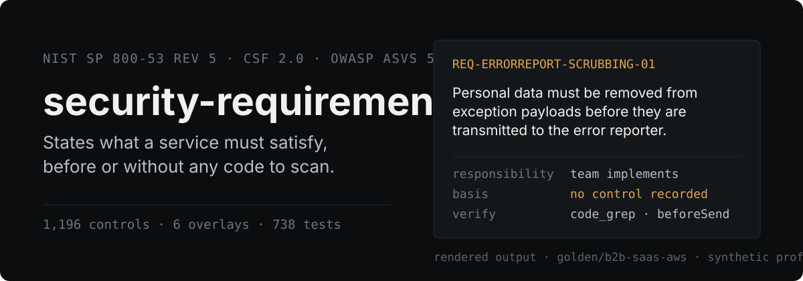
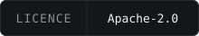

<p align="center">
  
</p>

<p align="center">
  <a href="./LICENSE"></a>
</p>

## Why this exists

Most security tools discover problems in code that already exists. This plugin
handles the earlier, prescriptive question: **what must this service satisfy?**

It turns design intent or repository evidence into a reviewable security
contract. Later design reviews and scanners can test service-specific
requirements instead of starting from a generic checklist.

## What existing plugins do not cover

`appsec-advisor` audits against an AppSec catalog. `tachi` produces threat and
vulnerability assessments. Claude Code Security Review and the Claude Security
plugin find implementation issues and propose patches.

Their primary artefact is an audit, threat assessment, finding, or patch. This
plugin's primary artefact is a **derived requirement set** selected from:

- confirmed business impact;
- SP 800-53B and ASVS baselines;
- service-specific STRIDE and LINDDUN threats;
- regulatory overlays; and
- cloud responsibility boundaries.

The claim is not that AI-assisted security analysis is new. No public plugin was
found covering this complete chain; that is a search result, not a uniqueness
proof.

## How it works

```text
design description OR repository evidence
  + seven owner answers
  -> confirmed profile                         human gate
     -> FIPS 199 impact -> baseline             completeness
     -> DFD boundaries -> threats               relevance
     -> declared regimes -> overlays            applicability
     -> provider + service -> responsibility    ownership
  -> inherent-risk proposal                    human digest confirmation
  -> atomic, trace-linked requirements
  -> design review and implementation evidence
```

The confirmed profile supplies facts code cannot establish: data sensitivity,
RTO/RPO, users, external boundaries, obligations, existing controls, and
jurisdiction. Unknown facts remain `UNDETERMINED`.

Models interpret architecture and draft threats and requirements. Deterministic
scripts select catalogs, calculate ratings, merge state, validate identifiers,
and render outputs. Models propose; humans approve.

## Output

Publishable documents go to `docs/security/`:

- `requirements.md` — atomic properties and verification criteria
- `traceability.md` — control and threat links
- `responsibility.md` — provider, organisation, and team ownership
- optional aggregate risk and design-review summaries

Sensitive architecture, threat, risk, approval, and implementation state stays
under `.security-requirements/` and should not be published.

## Install from a clean clone

Requires Python 3.12 or newer and PyYAML.

### Claude Code

```text
/plugin marketplace add s1ns3nz0/security-requirements
/plugin install security-requirements@security-requirements
```

Commands:

```text
/security-requirements:sec-req-init
/security-requirements:sec-req-build
/security-requirements:sec-req-refresh
/security-requirements:sec-req-risk
/security-requirements:sec-req-design-review
```

### Codex

```bash
git clone https://github.com/s1ns3nz0/security-requirements.git
cd security-requirements
codex plugin marketplace add .
codex plugin list --marketplace security-requirements
codex plugin add security-requirements@security-requirements
```

Use the corresponding skills, including `security-requirements-risk` and
`security-requirements-design-review`, or start with:

- “Initialize the security requirements profile for this repository.”
- “Build security requirements from the confirmed profile.”
- “Refresh security requirements after service changes.”
- “Assess and review threat risk for this repository.”
- “Review this service design against its existing threat model.”

## Documentation

- [Usage and operations](docs/usage.md) — local installation, updates, runtime,
  state, disclosure boundaries, and development commands
- [Design and derivation details](DESIGN.md) — data model, baseline selection,
  threat crossing, responsibility, risk governance, and assurance
- [Contributing](CONTRIBUTING.md) — service curation, overlays, and golden cases

## Scope and status

This is a pre-release requirements-driven review tool, not automatic
certification. It does not replace SAST, DAST, SCA, IaC scanning, penetration
testing, legal analysis, or qualified security review.

The deterministic layer, 2,165 tests, covers the full SP 800-53 Rev. 5 catalog,
CSF 2.0, ASVS 5.0, curated cloud services, regulatory overlays, state
transitions, and dual Claude Code/Codex packaging. Model-written requirement
quality has not been independently validated, and nobody outside this repository
has yet reported production use.

## Licence

Apache-2.0 for the code. Bundled reference data keeps its own terms; see
[NOTICE](NOTICE). NIST does not endorse this project.

This tool produces drafts. It is not legal advice and does not substitute for
compliance certification.