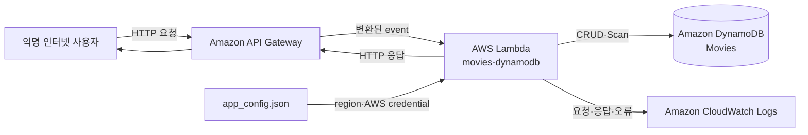

# 영화 평점 서비스를 설계하며 STRIDE 위협 모델링 해보기

영화 정보를 조회하고 평점을 남기는 작은 서비스를 만들어보려 했다. 출발점은 AWS의 공개 예제인 [`aws-serverless-crud-sample`](https://github.com/aws-samples/aws-serverless-crud-sample/tree/e974c2cce7b5c4774e0fbd18a9ba3c0208c3a37f)이었다.

API Gateway가 HTTP 요청을 받고 Node.js Lambda 하나가 작업을 구분한다. 영화 제목·연도·설명·평점은 DynamoDB의 Movies 테이블에 저장한다. 작은 코드도 배포 환경이 정해지면 새로운 신뢰 경계와 보안 조건이 생긴다.

## 분석 전에 운영 시나리오부터 정했다

같은 코드라도 사내 도구인지 인터넷 공개 서비스인지에 따라 위협은 달라진다. 코드 분석에 앞서 다음 운영 환경을 가정했다.

| 항목 | 운영 가정 |
|---|---|
| 서비스 | 영화 조회·등록·삭제·평점 API |
| 사용자 | 로그인하지 않은 인터넷 사용자도 접근 |
| 데이터 | 공개용 영화 제목·연도·설명·평점 |
| 배포 | Amazon API Gateway + AWS Lambda + Amazon DynamoDB |
| 복구 목표 | RTO 1일 이상, RPO 수시간 이상 |
| 규제·계약 | 별도 적용 사항 없음 |
| 조직 통제 | 중앙 인증, 접근 검토, 보안 전담 조직이 아직 없음 |
| 저장 리전 | 미정 |

공개 정보라 유출 피해는 작고 하루 중단도 감수할 수 있다. 그러나 영화 정보가 임의로 바뀌면 서비스 신뢰가 훼손된다. 영향도는 기밀성 Low, 무결성 Moderate, 가용성 Low로 두고 “누가 데이터를 바꿀 수 있는가”에 무게를 뒀다.

## 시스템 디자인과 데이터 흐름

분석 대상의 핵심 흐름은 다음과 같다.

자산에는 영화 레코드뿐 아니라 AWS 자격 증명, Lambda 권한, API 인가 정책, 로그, 감사 기록도 포함했다. 신뢰 경계는 인터넷–Gateway, Gateway–Lambda, Lambda–DynamoDB, 설정 파일–SDK, Lambda–CloudWatch 사이로 나눴다.

경계를 그리면 “인증이 안전한가?”보다 “익명 요청이 Gateway를 지나 쓰기 함수에 도달하는가?”처럼 질문이 구체적으로 바뀐다. STRIDE는 이런 질문의 누락을 막는 분류 체계로 썼다.

## T-01: 설정 파일에서 AWS 자격 증명이 유출될 수 있다

README는 `app_config.json`에 access key와 secret을 넣도록 안내한다. Lambda 코드도 이 파일을 읽어 `AWS.config.update()`에 값을 직접 전달한다.

placeholder는 비밀이 아니다. 하지만 운영자가 실제 장기 키를 넣으면 배포 ZIP, 노트북, 백업, Git 이력 중 한 곳의 노출이 AWS 자격 증명 유출로 이어진다. STRIDE의 Information Disclosure이며 권한 상승의 출발점이기도 하다.

서비스는 설정 파일에서 장기 AWS access key를 읽지 않아야 한다. Lambda 실행 역할로 자격 증명을 공급하고 `accessKeyId`와 `secretAccessKey` 입력 경로를 제거한다. 코드와 배포 환경을 검색해 검증한다.

## T-02: Lambda 하나가 계정 전체 권한을 가져갈 수 있다

README는 Lambda 역할과 IAM 사용자에게 `AWSLambdaFullAccess`, `AmazonDynamoDBFullAccess`를 부여하도록 안내한다. 튜토리얼을 빠르게 따라가기에는 편하지만 운영 권한으로는 지나치게 넓다.

함수가 침해되면 공격자는 같은 계정의 다른 Lambda와 DynamoDB까지 탐색하거나 변경할 수 있다. 실행 역할은 핸들러가 쓰는 DynamoDB 작업만 Movies 테이블에 허용해야 한다. FullAccess 정책과 Resource 범위를 검사한다.

## T-03: 익명 사용자가 영화 정보를 바꿀 수 있다

예제는 `/movies` 조회와 `/add-movie` 등록 경로를 제공한다. Lambda 내부에는 삭제와 평점 변경 작업도 있다. 하지만 API 정의와 핸들러에서 호출자의 신원을 확인하거나 작업 권한을 판정하는 코드는 찾지 못했다.

조회는 익명으로 허용해도 등록·삭제·평점 변경까지 열면 누구나 카탈로그를 조작한다. 이 위협은 Tampering이며 서비스의 Moderate 무결성에 직접 영향을 준다.

요구사항은 “인증을 적절히 구현한다”가 아니다. 생성·삭제·평점 변경 요청은 DynamoDB를 호출하기 전에 인증과 작업별 인가를 마쳐야 한다. 익명 요청과 읽기 전용 사용자의 쓰기 요청이 거부되는지 테스트한다.

## T-04: 검증되지 않은 입력이 저장소와 실행 자원을 소모한다

핸들러는 요청 본문의 `title`, `year`, `info`를 바로 DynamoDB 파라미터로 만든다. `year`에는 `parseInt()`를 적용하지만 허용 범위나 변환 실패를 검사하지 않는다. 경로와 query 값에도 명시적인 schema가 없다.

공격자는 긴 문자열, 예상 밖의 객체, 범위를 벗어난 숫자와 알 수 없는 작업명을 반복 전송할 수 있다. 잘못된 레코드가 쌓이고 Lambda 동시 실행과 DynamoDB 처리량이 소모된다.

각 API 작업은 입력의 type, length, range와 허용된 resource path를 DynamoDB 호출 전에 검사해야 한다. 잘못된 요청이 4xx로 끝나고 DynamoDB 호출은 발생하지 않는지를 자동 테스트로 확인한다.

## T-05와 T-06: 오류 응답과 로그가 내부 정보를 밖으로 옮긴다

DynamoDB 호출이 실패하면 코드는 AWS SDK 오류 객체를 JSON으로 직렬화해 응답 데이터에 넣는다. 내부 오류 메시지와 리소스 정보가 익명 사용자에게 전달될 수 있다.

API에는 공개 오류 코드와 correlation ID만 반환한다. 상세 정보는 제한된 로그에 남기되 자격 증명이나 전체 요청·응답 본문은 기록하지 않는다.

AccessDenied를 강제로 만들어 응답을 검사하고, 고유한 sentinel을 담은 요청이 CloudWatch에 나타나지 않는지 확인한다.

## T-07: 변경 작업을 누가 했는지 입증할 수 없다

현재 로그는 일반 응답 데이터를 출력할 뿐, 보안 감사 이벤트의 형식을 갖추지 않는다. 데이터가 삭제되거나 평점이 바뀌어도 행위자와 요청을 연결하기 어렵다. STRIDE의 Repudiation에 해당한다.

각 변경 시도는 사용자, 작업, 대상 키, 결과, correlation ID를 감사 이벤트로 남겨야 한다. 성공뿐 아니라 거부된 요청도 기록해야 공격 시도를 복원할 수 있다.

## T-08: 전체 경로가 아닌 마지막 문자열이 작업을 결정한다

가장 서비스에 특화된 위협은 라우팅 코드에서 나왔다. 핸들러는 `resourcePath.lastIndexOf("/")`로 마지막 슬래시 뒤 문자열만 추출한 다음 `switch`로 실행할 작업을 고른다.

`/public/add-movie`와 `/admin/add-movie`의 Gateway 정책이 달라도 Lambda는 둘을 모두 `add-movie`로 처리한다. 게이트웨이가 판단한 경로와 함수가 판단한 작업이 어긋난다.

이 항목은 일반 baseline 통제에 억지로 연결하지 않았다. 위협 모델에서만 나온 서비스 고유 요구사항으로 남겼다. Lambda는 전체 resource path와 HTTP method가 선언된 조합과 일치할 때만 작업을 실행해야 한다.

검증할 때는 작업명 앞에 선언되지 않은 prefix를 붙여 호출하고 DynamoDB 요청 없이 거부되는지 본다.

## 위협을 요구사항으로 바꾸고 나서 달라진 점

분석 결과 여덟 개의 위협에서 여덟 개의 요구사항이 나왔다. 일곱 개는 High, 감사 이벤트 요구사항 하나는 Medium이다. 각 요구사항에는 코드나 IAM 정책 검사, 우회 요청 같은 구체적인 검증 방법을 붙였다.

첫 초안은 검증 방법 enum 오류 6개와 여러 의무를 한 문장에 넣은 경고 2개로 lint에서 막혔다. 검증 방법을 `test_case`로 고치고 문장을 한 가지 판정 가능한 속성으로 좁히자 오류 0개, 경고 0개가 됐다.

## 위협 모델링의 출발점은 코드가 아니라 운영 맥락이다

영화 데이터가 공개 정보라는 사실만 봤다면 이 서비스를 Low impact로 끝냈을지도 모른다. 하지만 익명 사용자가 쓰기 경로에 접근하고, Lambda가 넓은 AWS 권한을 가지며, 게이트웨이와 함수가 경로를 다르게 해석한다는 운영 맥락을 더하자 다른 결론이 나왔다.

위협 모델링은 취약한 코드 줄을 나열하는 작업이 아니다. 자산과 경계를 정하고 공격 시나리오를 쓴 뒤, 이를 검증 가능한 시스템 속성으로 바꾸는 일이다.

이 흐름을 반복하려고 `security-requirements` 플러그인을 사용했다. 운영 가정을 먼저 확정하고 위협과 baseline을 교차하며, 최종 문장을 실제로 검사할 수 있는지 확인하는 역할만 맡겼다.

도구보다 중요한 것은 입력한 맥락이다. 인증 방식과 저장 리전은 아직 미정으로 남아 있다. 실제 배포 전에는 이 두 항목을 확정하고 위협 모델을 다시 실행해야 한다. 시스템 디자인이 바뀌면 위협 모델도 함께 바뀐다.

<!-- HUMANIZE-SUMMARY
원본 5,340자 / 윤문본 4,942자 / 변경률 7.5%
탐지: A-1 1→0, A-15 3→0, C-7 1→0, D-1 1→0, E-2 4→2, H-3 2→0
자체검증: 6/6 통과
등급: B — S1 잔존 0건, 기술 사실·수치·식별자 보존, 문단 리듬 조정
주요 변경: 플러그인 소개 중심 도입부 → 영화 평점 서비스 운영 시나리오 중심 도입부
주요 변경: 요구사항 목록 → DFD와 신뢰 경계에서 출발하는 위협별 인과 서술
주요 변경: 플러그인 설명을 결론의 보조 수단으로 축소
-->
