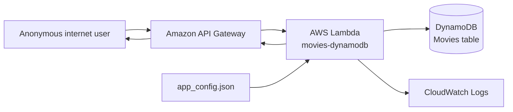

# Security Design Review: Movie Voting Sample — Calculating Blast Radius

Threat modeling tells us what can go wrong. It does not always tell us how far a failure can spread.

That distinction is useful even in a small serverless application. The AWS movie voting sample uses API Gateway, one Lambda function, DynamoDB, and CloudWatch Logs. The service is much smaller than a SaaS platform, but a compromised Lambda role or an anonymous write path can still affect more than one record.

The `security-requirements` plugin now calculates a blast radius for each threat. The result helps prioritize requirements and makes the expected scope of a failure explicit.

The source example is AWS’s archived [`aws-serverless-crud-sample`](https://github.com/aws-samples/aws-serverless-crud-sample/tree/e974c2cce7b5c4774e0fbd18a9ba3c0208c3a37f). In this scenario, users can browse movie information, while creation, deletion, and rating changes are treated as protected operations.

## Blast radius is not a vulnerability score

The plugin keeps three concepts separate:

```text
CIA impact
  How harmful would loss of confidentiality, integrity, or availability be?

Threat
  What concrete failure scenario are we analyzing?

Blast radius
  Which records, components, privileges, and recovery domains can the threat reach?
```

The movie data is public, so confidentiality is limited. Integrity is more important because unauthorized changes can alter the catalogue and ratings. A threat that reaches the whole DynamoDB table may still have a broader operational effect than a threat limited to one malformed request.

Blast radius does not replace the FIPS 199 impact level, threat likelihood, or a live penetration test. It adds a scope calculation to the requirements process.

## The movie voting data flow

The application flow is small:



Each connection is a potential boundary.

- API Gateway receives requests from the public internet.
- Lambda interprets the request and selects an operation.
- The Lambda role accesses DynamoDB.
- Configuration supplies the AWS SDK with region and credential values.
- Logs receive operational data and error details.

The graph used for the calculation represents these components and connections. It does not treat the presence of a service name in a README as proof of a complete security boundary.

## The five dimensions

For each threat, the plugin follows the declared path through the graph and records the broadest reachable value in five dimensions.

```text
tenant_scope
  one | subset | all

data_scope
  record | tenant_dataset | shared_dataset | platform_dataset

runtime_scope
  task | service | cluster | account | region

control_scope
  feature | tenant_operations | control_plane | platform

recovery_scope
  local | tenant_recovery | platform_recovery | regional_recovery
```

The movie sample is not multi-tenant, so `tenant_scope` is interpreted as the affected user or service population rather than as customer isolation. The important point is that the same vocabulary can be used for both a small application and a multi-tenant platform.

The output also includes a quick summary:

```text
contained
tenant
cross_tenant
platform
account_region
```

For this sample, a record-level validation error is usually `contained`, while a compromised Lambda role can become `platform` or `account_region` depending on the permissions attached to it.

## Example: anonymous movie mutations

One threat in the model is that an anonymous caller can reach a create, delete, or rating operation.

```text
anonymous internet user
  → API Gateway
  → Lambda operation dispatcher
  → Movies table
```

The calculated result can be represented as:

```yaml
blast_radius:
  tenant_scope: all
  data_scope: tenant_dataset
  runtime_scope: service
  control_scope: feature
  recovery_scope: tenant_recovery
coarse_scope: cross_tenant
```

There are no formal tenants in this sample. `all` means all users and all movie records served by this instance. The important consequence is integrity: an attacker does not need to compromise the AWS account to modify the shared catalogue if the write route is publicly reachable.

The threat is linked to the requirement rather than left as an isolated finding:

```yaml
id: REQ-API-WRITE-AUTHZ-01
managed:
  threat_refs: [T-03]
  blast_radius_refs: [T-03]
  statement: >-
    Every request that creates, deletes, or changes a movie rating must be
    authorized for that operation before DynamoDB is called.
  priority: high
```

The verification should include an anonymous request, a read-only identity, and an authorized write identity. A failed authorization test affects the whole movie dataset, not just the request that triggered it.

## Example: excessive Lambda permissions

The sample documentation recommends broad AWS managed policies for the Lambda role. If the function is compromised, the attacker may be able to access resources beyond the `Movies` table.

```text
compromised Lambda execution
  → Lambda execution role
  → DynamoDB / Lambda / other account resources
```

The result depends on the actual policy:

```yaml
blast_radius:
  tenant_scope: all
  data_scope: platform_dataset
  runtime_scope: account
  control_scope: platform
  recovery_scope: platform_recovery
coarse_scope: account_region
```

This is why a generic “use least privilege” statement is not enough. The requirement must identify the intended actions and the `Movies` table resource. The evidence must inspect the deployed role, not only the policy file in the repository.

AWS configuration evidence and source evidence can disagree. If the source restricts the role but the deployed policy still grants a broad managed policy, the result is `inconclusive` or `failed`, never `verified`.

## Example: configuration credentials

The sample reads AWS credential values from `app_config.json`. If real long-lived keys are placed there, a deployment artifact, backup, or source history can expose credentials outside the Lambda runtime.

The graph is different from the previous examples:

```text
configuration file
  → Lambda SDK configuration
  → AWS account APIs
```

The direct data item is a credential, but the possible runtime scope is much broader. The requirement is therefore not “encrypt the configuration file.” It is to remove long-lived credentials from the deployed application configuration and use the execution role instead.

The graph records the potential account-level consequence while the requirement records the specific property that can be tested.

## How the calculation works

The plugin keeps the human-authored threat model separate from the graph and derived output.

```text
threats.yaml
  threats and trust boundaries

blast-graph.yaml
  components, edges, scopes, and threat sources

blast-radius.json
  deterministic calculation
```

For each threat, the algorithm:

1. Reads the threat’s source node.
2. Traverses reachable graph edges.
3. Collects the affected nodes and edges.
4. Selects the broadest value for each dimension.
5. Records confidence, evidence, responsibility, and review work.
6. Applies an explicit priority policy.

The calculation is intentionally conservative. It does not claim that every reachable node is currently exploitable. It says that the reviewed graph does not yet establish a boundary that prevents the path.

## Confidence and review

Every result distinguishes evidence from inference.

```text
confirmed
  Directly supported by code, IaC, configuration, or review evidence

inferred
  Derived from the discovered design and connections

unknown
  The available information cannot establish the scope
```

For the movie voting sample, the presence of the Lambda-to-DynamoDB call can be confirmed from the code. Whether the deployed Lambda role can access other tables requires configuration evidence. Whether an anonymous request actually changes a record requires a test.

An unknown dimension receives a temporary High priority and `review_required: true`. That is a prompt to gather evidence, not a claim that the application has High impact.

## Where the result is used

### Requirement prioritization

The NIST baseline supplies completeness. Blast radius determines which threats deserve attention first.

```text
public write path + whole Movies table
  → high-priority authorization requirement

single malformed input + one request
  → lower-scope validation work

Lambda role + account-wide permissions
  → platform-level least-privilege requirement
```

### Evidence targeting

The affected scope determines the evidence to collect.

```text
feature scope
  → source inspection and API tests

table scope
  → IAM policy and cross-record access tests

account scope
  → deployed role, CloudTrail, and account-policy evidence
```

### Change detection

On refresh, the plugin compares the current result with the previous one.

```text
record → dataset
service → account
medium → high
```

If a change widens the scope, the affected requirements require review even when their IDs remain unchanged.

## What this result does not prove

Blast radius is not an exploit report, an incident estimate, or a compliance decision.

For this movie sample, a graph result showing account-level potential does not prove that an attacker can actually assume a second role. It identifies the scope that the current design and permissions could permit, and it tells us which evidence or test is needed next.

Similarly, a path that is not found in the graph is not proof of safety. It may mean that the graph is incomplete. That is why automatically generated edges remain `inferred` until reviewed.

## The outcome for the movie voting sample

The movie service started as a small CRUD example. The blast-radius calculation adds a more useful question to the review:

> If this threat succeeds, what part of the service can it affect?

For this sample, the answer separates anonymous write abuse, broad Lambda permissions, credential exposure, route confusion, error disclosure, and log leakage. Each scenario can now carry an explicit scope, a responsible owner, a priority reason, and a list of evidence still required.

That makes the output useful beyond the initial design review. The same result can guide security tests, deployment review, evidence collection, and refresh decisions when the service changes.

