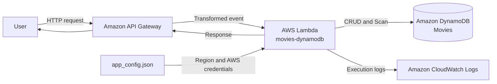

# Deriving Security Requirements from an AWS Serverless Sample, Part 1: Building the Service Profile

When defining security requirements, it is tempting to begin with questions such as “Do we need encryption?” or “Should we require MFA?” That approach skips over the purpose and operating environment of the system. The same code may need very different controls depending on whether it runs as an internal training tool or as a public service available to anonymous users.

The first task performed by the `security-requirements` plugin is therefore neither control selection nor vulnerability discovery. It first builds a profile of what the service is and how it is expected to operate.

In this article, we use AWS's `aws-serverless-crud-sample` as the starting point for a movie-rating service. We examine what the plugin can establish from the repository, what it must ask the service owner, and why each conclusion is justified.

The analysis is pinned to commit `e974c2c` so that the result remains reproducible. The repository is now an archived, older sample. We use it to explain the requirements-derivation process, not as a production deployment template. The original sample uses one Lambda function to distinguish among several API Gateway requests and perform CRUD operations against DynamoDB. [AWS sample repository](https://github.com/aws-samples/aws-serverless-crud-sample/tree/e974c2cce7b5c4774e0fbd18a9ba3c0208c3a37f)

---

## The first stage is not vulnerability discovery

The objective of this stage is to produce a service profile capable of answering one question:

> What does this system process, who uses it, where does our responsibility end, and what harm would result from an outage or the loss or corruption of its data?

The profile becomes the input to every later decision.

```text
Technical facts found in the repository
                    +
Operating intent and business impact confirmed by the owner
                    ↓
            Confirmed service profile
                    ↓
       Impact, baseline, and threat modeling
```

If the profile is wrong, everything derived from it can be consistently wrong. If an internet-facing write API is classified as an internal administration tool, for example, its authentication and authorization requirements may be too weak. If a learning application containing only public information is treated as a financial system, the tool may produce an unnecessarily large control set.

A convincing report is not evidence that its input was correct. For that reason, the plugin treats profile confirmation as a mandatory approval gate.

## A repository reveals facts, but not intent

The plugin separates profile information into two categories.

The first consists of technical facts for which repository evidence may exist:

- Cloud provider and managed services
- Runtime and programming language
- API and event entry points
- Data stores
- Implemented authentication technology
- External systems receiving data

The second consists of operating intent that code alone cannot establish:

- Who uses the service
- What data it will actually contain
- Which read and write operations may be anonymous
- How much downtime and data loss the business can tolerate
- Which regulatory or contractual obligations apply
- Which security controls the organization already provides
- Where its users are located

Mixing these categories creates unsafe conclusions. The existence of an `/add-movie` endpoint does not prove that anonymous movie creation is intended. The absence of authentication logic also does not prove that authentication is unnecessary. It describes the current implementation, not the intended security policy.

The plugin therefore infers only what the repository can support with evidence and asks the owner to confirm everything that depends on intent.

---

## 1. Identifying the AWS service architecture

The sample's README and code reveal the following structure.



The initial profile can record these findings as follows:

```yaml
inferred:
  csp: aws
  deployment_model: serverless

  managed_services:
    - aws-api-gateway
    - aws-lambda
    - aws-dynamodb
    - aws-cloudwatch-logs

  stack:
    - nodejs

  entrypoints:
    - GET /movies
    - POST /add-movie
```

### Why the plugin identifies AWS as the cloud provider

The conclusion does not come merely from `aws` appearing in the repository name.

The README explicitly instructs the operator to:

- Create an AWS Lambda function
- Create API Gateway resources and methods
- Create a DynamoDB table
- Select a Lambda execution role
- Configure an AWS region and DynamoDB endpoint

The code and configuration also contain AWS SDK usage, DynamoDB operations, and AWS credential fields. Several independent forms of evidence point to the same conclusion, so the profile can safely record `csp: aws`.

This corroboration matters because documentation and implementation frequently drift apart over time.

### Why the deployment model is Serverless

Requests are handled by AWS Lambda rather than a long-running EC2 instance or container. API Gateway receives external HTTP requests, while AWS supplies the Lambda execution environment on demand.

This classification changes the responsibility split later in the process.

Physical access to the data center, disposal of physical media, and server hardware maintenance are not controls that the delivery team implements directly. They become provider claims that must be supported by current assurance evidence.

The delivery team nevertheless remains responsible for matters such as:

- The permissions granted to the Lambda execution role
- Access policy for the DynamoDB table
- Authentication and authorization of write APIs
- Input validation
- The contents of application logs

Serverless therefore does not mean that AWS is responsible for all security.

### Why DynamoDB is classified as a data store

The README requires the creation of a `Movies` table, and the Lambda code performs DynamoDB CRUD operations. The table stores movie titles, release years, descriptions, and ratings.

This fact leads to questions that are more consequential than a simple technology inventory:

- Which identities may create, update, and delete records?
- Is the Lambda execution role limited to the `Movies` table?
- Can invalid input be persisted without validation?
- Can the service determine who changed a record?
- What backup and recovery objectives apply?

### Why CloudWatch Logs belongs in the data flow

The sample instructs the operator to inspect Lambda execution logs. The function may also record request results and error details.

Logs may look like a supporting feature, but they are another data store and another trust boundary. If request bodies or AWS SDK error objects are logged, data believed to exist only in DynamoDB is copied into the logging system.

A profile scan should therefore look beyond the primary database and include:

- Application logs
- Error-reporting systems
- Caches
- Message queues
- Backups and snapshots
- Analytics stores

For this sample, CloudWatch Logs is included in the later data-flow analysis. Exactly which values reach it is left for code analysis and threat modeling.

---

## 2. Interpreting the application entry points

The README shows at least these API operations:

```text
GET  /movies
POST /add-movie
```

The Lambda handler selects an operation from the supplied `resourcePath`. Its CRUD-oriented structure also supports actions such as creating, deleting, and rating movies.

The profile must separate the existence of an entry point from its intended security policy.

The repository supports these conclusions:

```text
GET /movies exists.
POST /add-movie exists.
The Lambda function selects an operation using resourcePath.
```

It cannot independently establish these conclusions:

```text
GET /movies should be available anonymously.
POST /add-movie should also be anonymous.
Any user should be able to change a rating.
```

The latter statements are product policy.

For this analysis, we add an explicit operating scenario: anonymous users may browse movies, while creation, deletion, and rating changes must be protected. This is not a fact discovered in the original repository; it is an assumption that must be confirmed by the service owner.

| Item | Source | Confidence |
|---|---|---|
| `GET /movies` exists | README and API configuration | Confirmed technical fact |
| `POST /add-movie` exists | README and API configuration | Confirmed technical fact |
| Anonymous users access the service over the internet | Operating scenario | Owner confirmation required |
| Anonymous reads are allowed | Product-policy assumption | Owner confirmation required |
| Write operations require authentication | Intended security policy | Owner confirmation required |

---

## 3. Why the authentication mechanism remains `UNDETERMINED`

The repository clearly uses API Gateway and Lambda, but it does not provide enough evidence of Cognito, OIDC, API keys, a Lambda authorizer, or another authentication design. The handler also contains no clear decision that identifies the caller and authorizes an operation.

The only defensible profile value is therefore:

```yaml
auth_mechanism: UNDETERMINED
```

“No authentication code was found” and “the service does not use authentication” are different claims.

Authentication may be configured outside this repository through:

- Manual API Gateway configuration
- Infrastructure as code in another repository
- A shared organizational authentication proxy
- A signature mechanism implemented by a private client
- A design that has not yet been implemented

The plugin does not turn absence of evidence into evidence of absence. Instead, it reports what the unresolved value costs downstream:

> Until the authentication design is confirmed, the boundary between anonymous and authenticated users cannot be modeled precisely, and access-control requirements for write operations remain provisional.

Our scenario assumes anonymous reads and protected writes, but the concrete identity provider and authorization policy must be selected before deployment.

---

## 4. Classifying the data

The code identifies the primary data fields as:

- Movie title
- Release year
- Movie description
- Rating

In this operating scenario, all four are treated as content intended for publication.

```yaml
declared:
  data_types:
    - id: public_content
      modifiers:
        - intended_public
```

### Why confidentiality is Low

The service stores this information in order to publish it. An unauthorized reader learning a movie title or public rating does not disclose an additional secret.

Low confidentiality impact is therefore appropriate.

That conclusion does not make every security impact Low. Publication affects confidentiality; it does not establish that the data may safely be altered or that the service may remain unavailable.

### Why integrity is not automatically Low

If an attacker can change movie titles, manipulate ratings, or delete records, the central purpose of the service is undermined. Public data can still become untrustworthy.

We therefore assign Moderate integrity impact in this operating scenario.

The reason comes from the purpose of the service, not from the sensitivity of the data:

```text
Whether movie data is public  → confidentiality
Whether movie data is correct → integrity
How long the service may stop → availability
```

Without separating these axes, it is easy to reach the mistaken conclusion that public data implies an entirely Low-impact system.

---

## 5. Why recovery objectives are not inferred from the repository

Neither the code nor the README defines an RTO or RPO.

- RTO asks how quickly the service must be restored.
- RPO asks how much data the business may lose after a failure.

The use of DynamoDB does not prove that the business requires high availability. A technically resilient managed service and a business recovery requirement are different facts.

For this article, we assume the following objectives for a small learning-oriented movie service:

```yaml
availability:
  rto: rto_day_plus
  rpo: rpo_hours_plus
  amplifiers: []
```

This means:

- An outage of a day or longer is tolerable.
- The service can tolerate losing several hours of changes.
- It is not tied to safety, direct revenue, statutory reporting, or a contractual availability SLA.

Availability impact is therefore Low.

This remains an operating assumption rather than a fact proved by the sample. If the same code became a commercial movie service supported by advertising revenue or a customer SLA, availability could rise to Moderate or higher.

---

## 6. Why external integrations are not declared absent

The directly visible external dependencies are AWS services. The sample does not show separate integrations with services such as Stripe, Sentry, or SendGrid.

Even so, the profile should be careful about asserting that no external integration exists. A deployed environment could add:

- A mobile analytics SDK
- An error-reporting service
- Email or push notifications
- A CDN or WAF
- A separate identity provider

A more accurate record for the current analysis is:

```yaml
external_integrations: []
scan_notes:
  - "No separate external SaaS integration was found in the inspected sample code"
```

This means “not found within the scan scope,” not “proved not to exist.” The distinction matters later when assessing third-party processing and cross-border transfer.

---

## 7. Why the storage region remains unresolved

The sample expects a region to be supplied in `app_config.json`, but it does not establish a production storage region. Even if `us-west-2` appears in an example command, an example value is not an approved deployment decision.

The profile therefore records:

```yaml
region_storage: UNDETERMINED
```

The plugin avoids guessing because storage location can change conclusions about:

- Cross-border transfers of personal data
- Potentially applicable regulations
- Recovery-region design
- Region-specific provider behavior
- Data-sovereignty and contractual requirements

The immediate privacy consequence is limited because this scenario contains only public movie data. The region must still be confirmed before deployment, especially if accounts or behavioral analytics are added later.

---

## 8. Organizational controls cannot be inferred from application code

The repository does not reveal whether the organization operates:

- Centralized SSO
- A dedicated security function
- Periodic access reviews
- Centralized log collection
- An incident-response process
- An information-security policy set

For this example, we assume that none has yet been established:

```yaml
existing_org_controls: []
```

The question matters because the plugin must avoid assigning the wrong work to the delivery team.

If the organization already provides centralized authentication, for example, the requirement should not tell the team to build a new SSO platform. It should say:

> Administrative functions must be accessible only to users authenticated through the organization's centralized identity platform.

An existing organizational control does not delete the requirement. It changes who is expected to answer it.

---

## 9. The resulting first-stage profile

The findings can now be summarized as follows:

```yaml
version: "0.1.0"
locale: en

inferred:
  csp: aws
  deployment_model: serverless

  managed_services:
    - id: aws-api-gateway
      basis: repository_evidence
    - id: aws-lambda
      basis: repository_evidence
    - id: aws-dynamodb
      basis: repository_evidence
    - id: aws-cloudwatch-logs
      basis: repository_evidence

  stack:
    - nodejs

  auth_mechanism: UNDETERMINED

  entrypoints:
    - GET /movies
    - POST /add-movie
    - additional CRUD operations handled by Lambda

  external_integrations: []
  region_storage: UNDETERMINED

declared:
  data_types:
    - id: public_content
      modifiers:
        - intended_public

  availability:
    rto: rto_day_plus
    rpo: rpo_hours_plus
    amplifiers: []

  users:
    - anonymous_external

  regulations_declared: []
  existing_org_controls: []

operating_assumptions:
  anonymous_read: allowed
  anonymous_write: not_allowed
  integrity_importance: moderate
```

The `inferred` section contains facts supported by repository evidence. The `declared` and `operating_assumptions` sections contain business context that the service owner must confirm.

## Profile confirmation summary

The proposed operating context for this analysis is:

| Area | Decision | Basis |
|---|---|---|
| Service | API for browsing, adding, deleting, and rating movies | README and Lambda behavior |
| Deployment | API Gateway, Lambda, and DynamoDB | Explicit repository configuration |
| Deployment model | Serverless | Request-driven Lambda execution |
| Users | Anonymous internet users | Operating assumption for the article |
| Data | Public movie information and ratings | Field semantics and service purpose |
| Confidentiality | Low | Data is intended for publication |
| Integrity | Moderate | Unauthorized changes undermine the core service |
| Availability | Low | Assumed tolerance for an outage of at least one day |
| Authentication mechanism | Undetermined | Insufficient code and configuration evidence |
| Storage region | Undetermined | Example region is not an operating decision |
| Regulation and contracts | None declared | Assumption for the analysis |
| Organizational controls | Assumed absent | Cannot be established from the sample repository |

This profile must be confirmed before the pipeline proceeds. Two items in particular should not remain unresolved in a real deployment:

- The authentication and authorization design for write operations
- The production data-storage region

The analysis can continue with unresolved values, but its output must state the resulting limitations.

## The most important conclusion from the first stage

The first stage did not produce a vulnerability list. It established a more important analytical priority:

> For this service, unauthorized modification matters more than disclosure.

Looking only at the fact that movie data is public could lead to a Low rating on every axis. The purpose of the service changes that conclusion. If anyone can alter its data, the service fails even when no confidential information is exposed.

That distinction allows the next stage to calculate Low confidentiality, Moderate integrity, and Low availability instead of treating the entire application as Low impact. The Moderate integrity result then determines the starting control baseline.

In Part 2, we will use this confirmed profile to calculate CIA impact and explain why this small movie service begins with the NIST SP 800-53B Moderate baseline.
