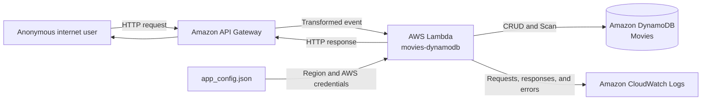

# Threat Modeling a Serverless Movie Rating Service with STRIDE

I wanted to build a small service where users could browse movie information and submit ratings. I started with AWS's public [`aws-serverless-crud-sample`](https://github.com/aws-samples/aws-serverless-crud-sample/tree/e974c2cce7b5c4774e0fbd18a9ba3c0208c3a37f) repository.

The design is straightforward. Amazon API Gateway receives HTTP requests, and a single Node.js Lambda function selects the requested operation. Movie titles, release years, descriptions, and ratings are stored in a DynamoDB table named `Movies`.

Small code does not necessarily mean a small attack surface. Once we define how the application will be deployed and operated, new trust boundaries and security constraints appear.

This article walks through a STRIDE threat model for that system design and shows how each threat became a testable security requirement.

## Start with the operating scenario

The same code has a different threat model depending on whether it runs as an internal administration tool or as a public internet service. Before inspecting individual code paths, I made the following operating assumptions.

| Area | Assumption |
|---|---|
| Service | API for browsing, adding, deleting, and rating movies |
| Users | Anonymous internet users may access the service |
| Data | Public movie titles, release years, descriptions, and ratings |
| Deployment | Amazon API Gateway, AWS Lambda, and Amazon DynamoDB |
| Recovery targets | RTO of one day or longer; RPO of several hours |
| Regulation and contracts | No additional obligations declared |
| Organizational controls | No central identity service, access-review process, or dedicated security team yet |
| Storage region | Undetermined |

Disclosure of public movie information would have limited impact, and the service could tolerate a day-long outage. Unauthorized modification is different: manipulated titles or ratings would damage the integrity of the service.

I therefore classified the impact as Low for confidentiality, Moderate for integrity, and Low for availability. The threat analysis focused less on what an attacker could read and more on who could modify data or acquire AWS privileges.

## System design and data flow

The main data flow looks like this:

The assets are not limited to movie records. They also include AWS credentials, the Lambda execution role, API authorization policy, operational information in logs, and the audit records needed to attribute a change.

I identified five trust boundaries:

- The internet and API Gateway
- API Gateway and Lambda
- Lambda and DynamoDB
- The configuration file and AWS SDK
- Lambda and CloudWatch Logs

Drawing those boundaries changes the questions. Instead of asking whether “authentication is secure,” we can ask whether an anonymous request can cross API Gateway and reach a write operation. STRIDE helps make those questions systematic.

## T-01: AWS credentials can leak from the configuration file

The README instructs the operator to put an access key and secret key in `app_config.json`. The Lambda code reads that file and passes its values directly to `AWS.config.update()`.

The placeholders committed to the repository are not secrets. The threat appears when an operator replaces them with real long-lived credentials. Exposure of a deployment archive, developer laptop, backup, or Git history could then disclose credentials for the AWS account.

This is an Information Disclosure threat and a possible starting point for privilege escalation. An attacker could use a stolen IAM user's credentials to call AWS APIs outside the Lambda execution context.

The resulting requirement is specific: the deployed service must not load long-lived AWS access keys from an application configuration file.

The function should receive credentials from its execution role, and the `accessKeyId` and `secretAccessKey` input paths should be removed. We can verify this by searching the application configuration and SDK initialization code, then inspecting the deployed environment.

## T-02: One Lambda function can receive account-wide permissions

The README recommends attaching `AWSLambdaFullAccess` and `AmazonDynamoDBFullAccess` to the Lambda role and an IAM user. That may simplify a tutorial, but it is too broad for an operating service.

If the function is compromised, the attacker would not be limited to the `Movies` table. They could enumerate or modify unrelated Lambda functions and DynamoDB tables in the same account.

The Lambda execution role must therefore grant only the DynamoDB actions used by the handler and only on the `Movies` table.

Verification consists of checking that no FullAccess managed policy is attached and that the IAM policy's `Resource` is restricted to the intended table.

## T-03: Anonymous users can modify movie data

The sample exposes movie retrieval and creation routes, while the Lambda handler also contains branches for deletion and rating changes. I found no authentication or authorization decision in the API definition or handler.

Anonymous reads may be acceptable under this operating scenario. Anonymous creation, deletion, and rating changes are not. They allow any internet user to tamper with the catalogue and directly affect its Moderate integrity requirement.

“Implement appropriate authentication” would be too vague. The concrete requirement is that every create, delete, or rating request must be authenticated and authorized for that operation before DynamoDB is called.

The test should send each write request anonymously and as a read-only user. Both requests must be rejected before any DynamoDB operation occurs.

## T-04: Unvalidated input can consume storage and execution capacity

The handler copies `title`, `year`, and `info` from the request body into DynamoDB parameters. It calls `parseInt()` for `year`, but it does not enforce a valid range or handle failed conversion. There is no explicit schema for route or query values either.

An attacker could repeatedly submit oversized strings, unexpected object structures, out-of-range numbers, or unknown operation names. This could create malformed records and consume Lambda concurrency or DynamoDB capacity.

Each API operation must validate field types, lengths, ranges, and allowed resource paths before calling DynamoDB.

Tests should submit malformed, oversized, out-of-range, and unknown-operation requests. Each must return a client error without producing a DynamoDB request.

## T-05 and T-06: Error responses and logs move internal data across boundaries

When DynamoDB fails, the code serializes the AWS SDK error object and places it in the response data. Internal error messages and resource details may therefore reach an anonymous client.

The API should return only a stable public error code and correlation ID. Detailed diagnostics may be written to restricted logs, but credentials and complete request or response bodies must not be logged.

To verify the response behavior, force a DynamoDB `AccessDenied` error and inspect the complete client-visible response.

To verify logging behavior, send unique sentinel values in request headers and bodies, then confirm that those values do not appear in CloudWatch Logs.

## T-07: The service cannot prove who changed a record

The current logging records general response data but does not define a security audit event. If a movie is deleted or a rating changes, investigators may be unable to connect the action to an identity and request.

This is a Repudiation threat. Every attempted mutation must emit an audit event containing the authenticated caller, operation, target record key, result, and correlation ID.

Both successful and denied operations must be recorded so that an investigation can reconstruct legitimate activity and attempted abuse.

## T-08: The final path segment determines the operation

The most application-specific threat came from the routing code. The handler calls `resourcePath.lastIndexOf("/")`, extracts only the final path segment, and uses that value in a `switch` statement.

Suppose `/public/add-movie` and `/admin/add-movie` have different API Gateway policies. The Lambda function interprets both as `add-movie`. The route authorized by the gateway and the operation selected by the function can therefore diverge.

I did not force this threat into a generic baseline control. It remained an application-specific requirement derived directly from the threat model.

The Lambda handler must accept an operation only when the complete API Gateway resource path and HTTP method match a declared operation.

The test should call a privileged operation through an undeclared prefixed path and verify that the request is rejected without invoking DynamoDB.

## Turning threats into requirements

The eight threats produced eight requirements. Seven were assigned High priority, while the audit-event requirement was assigned Medium priority. Each requirement received a concrete verification method such as source inspection, IAM policy inspection, or an adversarial request test.

The first draft did not pass its quality gate. The linter reported six errors because I had invented an unsupported verification-method enum. It also produced two warnings because individual statements combined multiple obligations.

I replaced the verification method with the supported `test_case` value and narrowed each statement to one decidable property. The next run completed with zero errors and zero warnings.

That step matters. A requirement should not merely sound sensible; two engineers should be able to reach the same conclusion about whether the system satisfies it.

## Threat modeling begins with operating context, not code

Looking only at the public movie data might lead to a Low-impact classification. The conclusion changes once we add the operating context: anonymous users reach write routes, one Lambda role has broad AWS permissions, and the gateway and function interpret routes differently.

Threat modeling is not a list of suspicious lines. It defines assets and trust boundaries, describes what happens when an attacker crosses those boundaries, and converts each scenario into a testable system property.

I used the `security-requirements` plugin to make this process repeatable. Its role was deliberately limited: confirm the operating assumptions first, cross the threats with the selected control baseline, and check whether every resulting requirement could actually be verified.

The context remains more important than the tool. Authentication design and storage region are still undetermined. Both must be resolved before deployment, after which the threat model should be run again. When the system design changes, its threat model must change with it.
