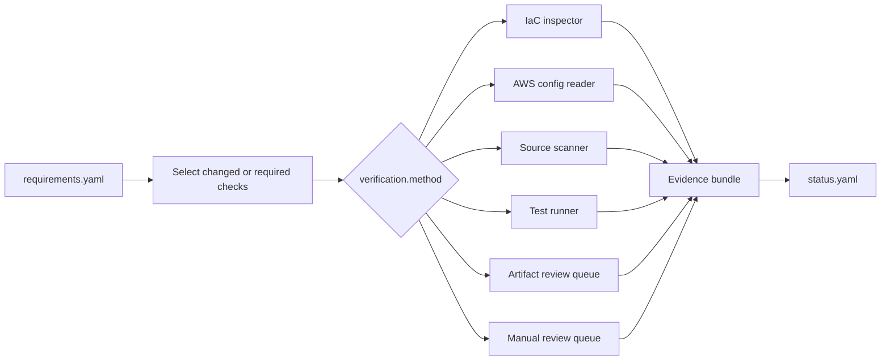

# Deriving Security Requirements from an AWS Serverless Sample, Part 8B: Connecting Requirements to CI/CD Verification

Every requirement in the movie-service contract includes a verification method, target, and expected result.

That metadata creates a natural integration point for CI/CD:

```text
security requirement
        ↓
machine-readable verification contract
        ↓
source, IaC, configuration, or test check
        ↓
evidence and requirement status
```

The current plugin describes how a requirement can be verified. It does not provide a complete universal verification engine. This post describes a downstream implementation pattern that can consume the contract safely.

---

## Start from the closed verification-method set

The requirement linter accepts these methods:

```text
iac_inspect
config_api
code_grep
test_case
artifact_review
manual
```

The set is closed because downstream automation needs a predictable dispatch key.

```yaml
verification:
  method: iac_inspect
  target: "the IAM policies attached to the movie Lambda role"
  expect: >-
    no FullAccess policy and DynamoDB access limited to the Movies table
```

An invented value such as `check_aws_somehow` fails linting instead of becoming an instruction that no tool understands.

---

## Not every method should be automated

| Method | Typical execution |
|---|---|
| `iac_inspect` | Parse Terraform, CloudFormation, CDK output, or a resolved plan |
| `config_api` | Query deployed AWS configuration using a read-only identity |
| `code_grep` | Search source or deployment artifacts for a defined construct |
| `test_case` | Run an automated unit, integration, or adversarial test |
| `artifact_review` | Review a report, agreement, inventory, or approval record |
| `manual` | A person performs and records a judgment-based check |

`artifact_review` and `manual` should not be converted into a superficial keyword search merely to produce a green check mark. Automation should report them as requiring human evidence unless a trustworthy domain-specific validator exists.

---

## A dispatcher architecture



The dispatcher does not treat the free-text `expect` field as executable code. Each automated requirement needs a reviewed adapter or policy rule that knows how to evaluate the property.

This avoids turning natural-language generation into arbitrary CI execution.

---

## Example 1: Inspect the Lambda IAM policy

Requirement:

```yaml
id: REQ-IAM-LAMBDA-SCOPE-01
verification:
  method: iac_inspect
  target: "the IAM policies attached to the movie Lambda execution role"
  expect: >-
    no FullAccess managed policy and DynamoDB access limited to the Movies table
```

A reviewed CI adapter can check:

1. No attached managed-policy ARN ends in `FullAccess`.
2. Allowed DynamoDB actions are in the approved action set.
3. The resource resolves to the intended table.
4. No wildcard resource grants access to unrelated tables.

Illustrative output:

```json
{
  "requirement_id": "REQ-IAM-LAMBDA-SCOPE-01",
  "result": "fail",
  "observed": {
    "managed_policy": "AmazonDynamoDBFullAccess",
    "resource": "*"
  },
  "evidence": "artifacts/iam/movie-lambda-policy.json"
}
```

The check should store the resolved policy it actually evaluated, not only a console log saying that the job failed.

---

## Example 2: Test anonymous and unauthorized writes

Two atomic requirements produce two test groups.

```text
REQ-API-WRITE-AUTHN-01
  → anonymous mutation requests must fail

REQ-API-WRITE-AUTHZ-01
  → authenticated read-only mutation requests must fail
```

The integration test should verify both response and side effect.

```text
POST /add-movie without identity
  expect: 4xx
  expect: no item created

DELETE /movies/example as read-only user
  expect: 4xx
  expect: item still exists
```

A 403 response alone is insufficient if the backend mutation already occurred before the error was returned.

Evidence should include:

- Request identity class
- Route and method
- Response status
- Target record identifier for synthetic test data
- Before-and-after DynamoDB observation
- Correlation identifier

---

## Example 3: Detect secrets in logs with sentinels

Requirement:

```yaml
id: REQ-LOG-SENSITIVE-DATA-01
verification:
  method: test_case
  target: "CloudWatch logs after requests containing unique sentinel values"
  expect: "no prohibited sentinel is present"
```

The test can generate a unique value for each prohibited field.

```text
Authorization: Bearer CI-AUTH-7F91
Cookie: session=CI-COOKIE-2A10
body.info: CI-BODY-42C8
```

After the request is processed and logs have arrived, a read-only test identity searches the relevant log group.

```text
found no prohibited sentinel
  → candidate pass evidence

found CI-AUTH-7F91
  → fail with log event reference

log access unavailable or delivery incomplete
  → undetermined, not pass
```

Tests must account for log-delivery latency without turning a timeout into a false pass.

---

## Example 4: Verify exact route dispatch

T-08 produced a requirement with no adequate baseline source.

```yaml
id: REQ-ROUTE-EXACT-DISPATCH-01
verification:
  method: test_case
  target: "undeclared prefixes and method-and-path combinations"
  expect: "request rejected and no DynamoDB operation occurs"
```

Adversarial cases include:

```text
POST /unexpected-prefix/add-movie
POST /public/delete-movie
GET  /add-movie
```

The test proves that the Lambda operation is bound to the complete route-and-method pair, not merely to the final path segment.

This example demonstrates why CI should execute requirements rather than only generic scanner rules. A generic SAST tool may not understand the security meaning of the API Gateway-to-Lambda interpretation difference.

---

## Run the right checks at the right time

### Pull request

Good candidates include:

- Requirement linting
- Control and threat reference validation
- Source checks
- IaC inspection
- Unit-level authorization tests
- Route-dispatch tests

### Pre-deployment

Good candidates include:

- Resolved Terraform or CloudFormation plan inspection
- Policy simulation
- Deployment-package secret inspection
- Verification that required evidence inputs are available

### Post-deployment

Good candidates include:

- Read-only AWS configuration queries
- API integration tests
- DynamoDB side-effect checks using synthetic records
- CloudWatch sentinel searches
- Audit-event inspection

### Scheduled assurance

Good candidates include:

- Drift detection
- Runtime support checks
- Exception-expiry checks
- Evidence freshness checks
- Revalidation after provider or policy changes

One check at pull-request time cannot prove a property that depends on deployed configuration and runtime behavior.

---

## Change-aware verification

Running every check on every commit may be expensive. The requirement graph can select checks based on changed assets.

```text
IAM or Terraform change
  → rerun IAM-scope and deployed-policy checks

API route or authorizer change
  → rerun authentication, authorization, and route-dispatch checks

logging code change
  → rerun sentinel and audit-event checks

data-type or external-integration change
  → rerun profile derivation, privacy analysis, and overlay checks
```

Change selection is an optimization, not an assurance shortcut. Scheduled full verification is still needed to detect drift and missed dependencies.

---

## Evidence should be tamper-evident and reproducible

An evidence record should contain enough context to reproduce the conclusion.

```yaml
requirement_id: REQ-IAM-LAMBDA-SCOPE-01
result: fail
checked_at: "2026-08-17T10:30:00Z"
checker: "iam-policy-adapter@sha256:..."
subject:
  environment: staging
  deployment_revision: "git:..."
inputs:
  - "resolved IAM policy artifact digest"
observed:
  managed_policy: AmazonDynamoDBFullAccess
  resource: "*"
evidence_digest: "sha256:..."
```

Evidence should be stored where the application identity under review cannot rewrite it. Build provenance, immutable artifact storage, and restricted evidence-writing roles improve confidence in the result.

---

## CI results are not certification

Automated checks have strict limits.

- A passing IAM rule does not prove that the whole access-control design is adequate.
- A successful API test covers the identities and paths tested, not every possible authorization state.
- A clean sentinel search covers the supplied fields and observed log destinations.
- A valid regulatory trace link does not establish legal compliance.
- A passing build does not replace independent semantic or assurance review.

CI produces repeatable evidence for defined properties. It does not turn the pipeline into an automatic certification authority.

---

## An illustrative pipeline result

```text
Security requirement verification

PR checks
  requirement lint                  pass
  IAM least privilege              fail
  anonymous write tests            pass
  read-only authorization tests    pass
  exact route dispatch             fail

Post-deployment checks
  public error contract            pass
  sensitive logging                undetermined
  mutation audit events            conditional

Blocking failures
  REQ-IAM-LAMBDA-SCOPE-01
  REQ-ROUTE-EXACT-DISPATCH-01

Manual evidence required
  provider assurance report
  analytics processing agreement
  cross-border transfer record
```

The pipeline may block release on High-priority failures while allowing `undetermined` or `conditional` results only under an approved policy and time-bounded exception.

---

## What Part 8B established

1. Verification metadata provides a stable handoff from requirements to CI/CD.
2. Automation dispatches on reviewed method types rather than executing generated prose.
3. IaC, deployed configuration, and operating tests answer different layers of the evidence question.
4. Authentication and authorization checks verify side effects as well as HTTP responses.
5. Sentinel tests turn logging requirements into observable properties.
6. Service-specific requirements such as exact route dispatch can be tested even when generic scanners do not understand them.
7. Evidence records need subject, revision, checker, observation, time, and digest information.
8. `artifact_review` and `manual` work remain human review unless a trustworthy specialized validator exists.
9. CI evidence supports requirement assessment but does not establish certification or compliance.

Together, Parts 8A and 8B show the two directions a derived security contract can travel: outward toward regulatory accountability and inward toward continuous engineering verification.
